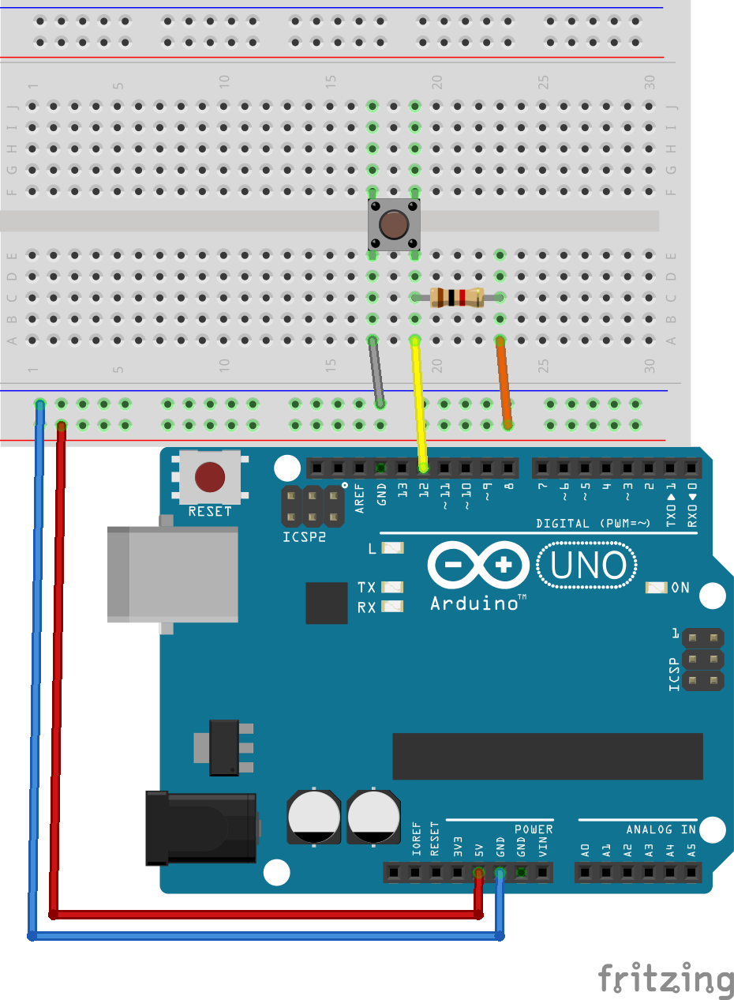
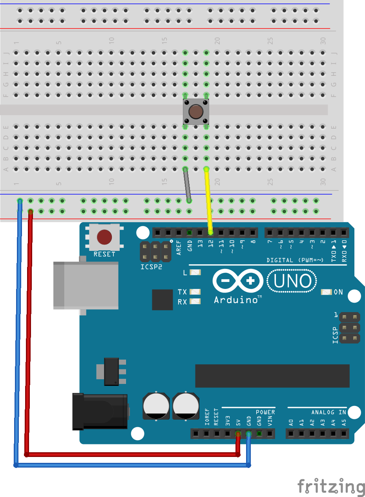

# Botón

### Conexión:
Los pines del botón están conectados internamente de manera vertical (segun la imagen) y al presionarlo se hace contacto ente ambos lados.
Se requiere conectar un lado a GND y el otro, mediante una resistencia de 1Kohmio a 5V(pull up) para obtener ambas señales.
<p align="center">

</p>
### Lectura simple
Nos permite leer el estdo de un pin, retorna 0 o 1.
```c++
int boton = 12; //evitar usar pines 0 y 1
void setup() {
  //inicializa la comunicacion serial
  Serial.begin(9600); //9600 es la "velocidad", el mismo valor debe ser seleccionado en el monitor serial
  pinMode(pushButton, INPUT);//declaramos el pin como una entrada digital (HIGH o LOW, 0 o 5V)
}

void loop() {
  int buttonState = digitalRead(pushButton); //lee el estado del pin (0 o 1, 0 o 5v)
  Serial.println(buttonState);//imprime el estado del pin
  delay(10);        // espera para la siguiente lectura
}
```


### Configuración sin resistencia externa
El Arduino cuenta con la capacidad de simular la resistencia externa colocada en el primer ejempo, pero para esto debemos cambiar el tipo de pin en el setup.
<p align="center">

</p>
```c++
int boton = 12; //evitar usar pines 0 y 1
void setup() {
  //inicializa la comunicacion serial
  Serial.begin(9600); //9600 es la "velocidad", el mismo valor debe ser seleccionado en el monitor serial
  pinMode(pushButton, INPUT_PULLUP);//declaramos el pin como una entrada digital (HIGH o LOW, 0 o 5V), con resistencia Pullup
}

void loop() {
  int estado = digitalRead(boton); //lee el estado del pin (0 o 1, 0 o 5v)
  Serial.println(estado);//imprime el estado del pin
  delay(10);        // espera para la siguiente lectura
}

```


### Disminuir ruido
```c++


```
