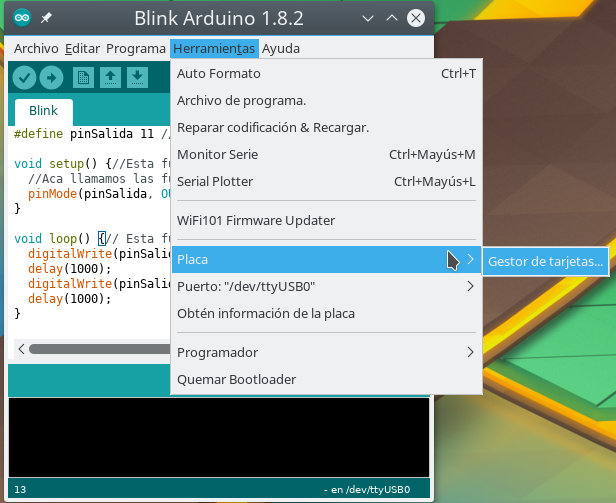
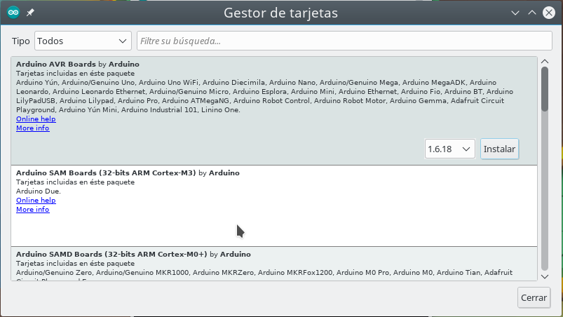

# Instalación

## Descarga
El IDE se puede descargar [aquí](https://www.arduino.cc/en/Main/Software).

En Linux se puede instalar desde el manejador de paquetes, pero se debe revisar que sea una versión actualizada (1.7 o mayor) y que el usuario pertenezca al [grupo correspondiente](https://wiki.archlinux.org/index.php/Arduino#Accessing_serial) (uucp, lock o dialout).

## Instalación de tarjetas
En Arduino 1.8 es necesario instalar las tarjetas que vamos a utilizar, esto se hace desde el mismo IDE.
* Ir a Herramientas -> Placa -> Gestor de tarjetas

* Buscar "Arduino AVR Boards" y presionar instalar.

## En caso de que el Arduino no aparezca conectado

* Desconectar y conectar la tarjeta
* Revisar que no haya un cortocircuito
* Revisar permisos de ejecución (Linux)
* Reinstalar drivers (Windows)
* Reiniciar la computadora
