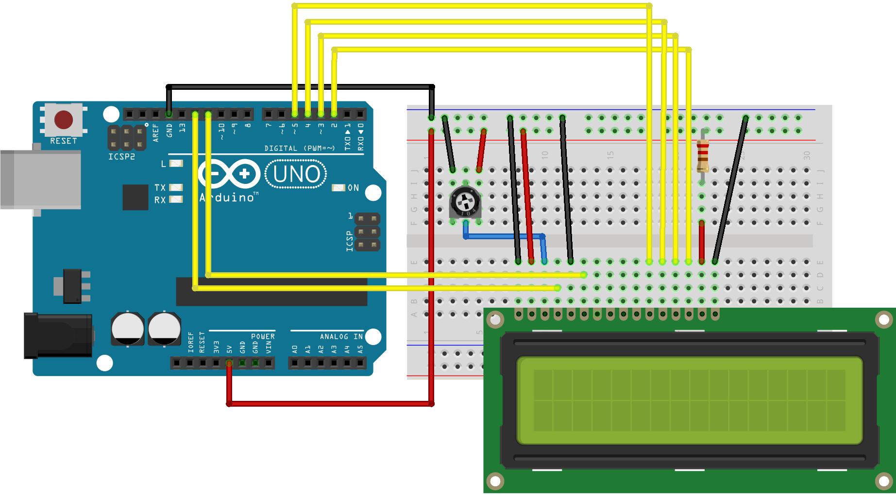

# LCD

### Conexión:
* LCD RS al pin digital 12
* LCD Enable al pin digital 11
* LCD D4 al pin digital 5
* LCD D5 al pin digital 4
* LCD D6 al pin digital 3
* LCD D7 al pin digital 2
* Resistencia e 220ohms entre +5V y LED+ (pin 15)

  Se utiliza un potenciometro para regular el contraste de la pantalla. Los pines exteriores van a GND y +5V, el del centro se conecta a V0

<p align="center">

</p>

### Lectura simple
Nos permite leer el estdo de un pin analógico, retorna un valor entre 0 y 1023.
```c++
// incluir la libreria
#include <LiquidCrystal.h>

// inicializar la libreria
LiquidCrystal lcd(12, 11, 5, 4, 3, 2);

void setup() {
  // seleccionamos la cantidad de filas y columnas de la pantalla
  lcd.begin(16, 2);
  // Imprimimos un mensaje de prueba
  lcd.print("Hola mundo!");
}

void loop() {
  // movemos el cursor a la segunda fila (inicia en 0)
  lcd.setCursor(0, 1);
  // imprimimos el tiempo que ha pasado desde que inicio el programa
  lcd.print(millis() / 1000);
}
```
