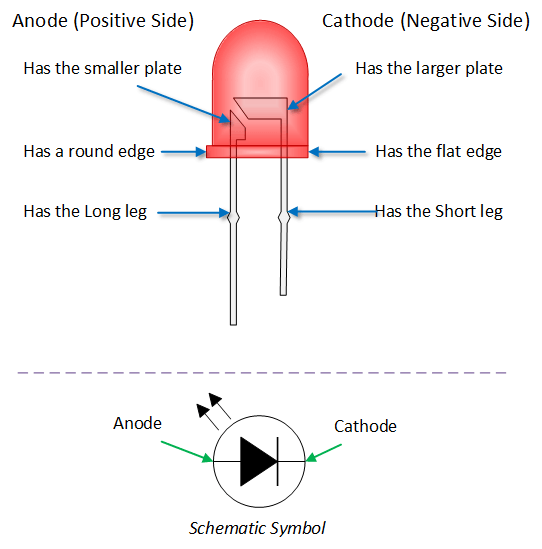
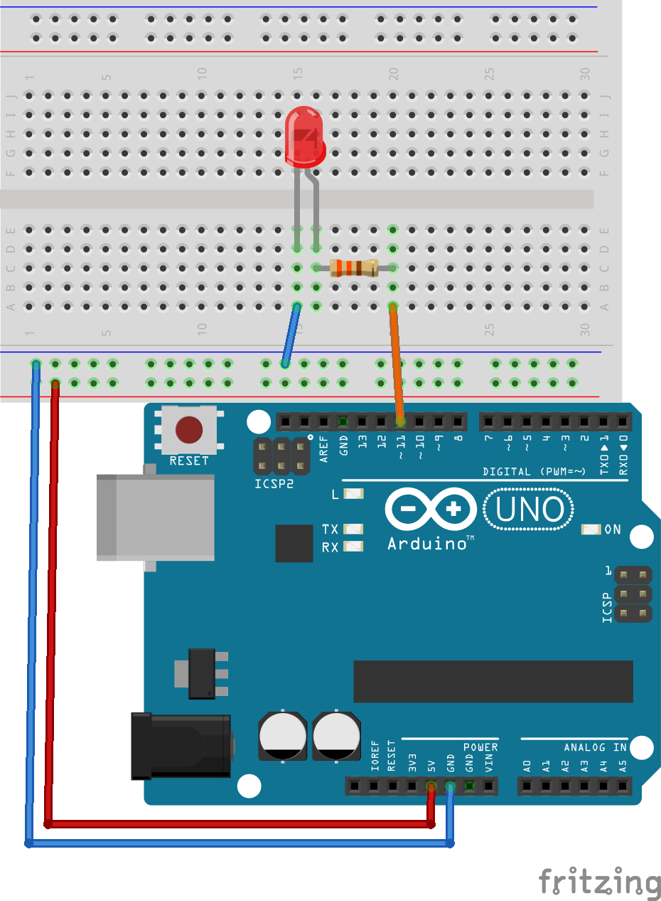

# LED
### Polaridad
El pin negativo del LED se puede distinguir de dos maneras:

* Tiene la patilla más corta
* Tiene una muesca (lado plano)
<p align="center">

</p>

### Conexión
Al conectar un LED ser requiere colocar una resistencia en serie con este, para que se dañe por un exceso de corriente. Normalmente esta resistencia es de 330 o 470 ohmios.
<p align="center">

</p>


### Parpadeo simple
La función “digitalWrite(pin, estado)” nos permite encender o apagar (0 o 5 voltios) un pin del Arduino, con esta señal podemos controlar el encendido de un LED.
```c++
#define pinSalida 11 //definimos una constante con el pin que vamos a utilizar

void setup() {//Esta funcion solo se ejecuta una vez
  //Aca llamamos las funciones de configuracion (modo de pines, inicializar el puerto serial, etc...)
  pinMode(pinSalida, OUTPUT); //inicializamos el pin como una salida
}

void loop() {// Esta fucion se repite infinitamente
  digitalWrite(pinSalida, HIGH);   //pone 5V en el pin (enciende el LED)
  delay(1000);                     //espera 1000 milisegundos
  digitalWrite(pinSalida, LOW);    //pone 0V en el pin (apaga el LED)
  delay(1000);
}

```

### PWM
Con la función “analogWrite(pin, valor)” podemos controlar voltajes intermedios entre 0 y 5V. El parámetro “valor” debe ser un numero entre 0 y 255.
```c++
#define pinSalida  11 // pin PWM (puede ser 3, 5, 6, 9, 10 o 11)

void setup() {
  pinMode(pinSalida, OUTPUT); //declaramos el pin como una salida
}

void loop() {
  //analogWrite(pinSalida, brillo) define el brillo del LED
  // el brillo debe ser un valor entre 0 y 255
  analogWrite(pinSalida, 50)
  delay(500);
  analogWrite(pinSalida, 150)
  delay(500);
  analogWrite(pinSalida, 250)
  delay(500);
  for (int brillo = 0; brillo < 256; brillo++) { //ciclo que va incrementando el brillo
    analogWrite(pinSalida, brillo)
    delay(5);
  }
}

```
