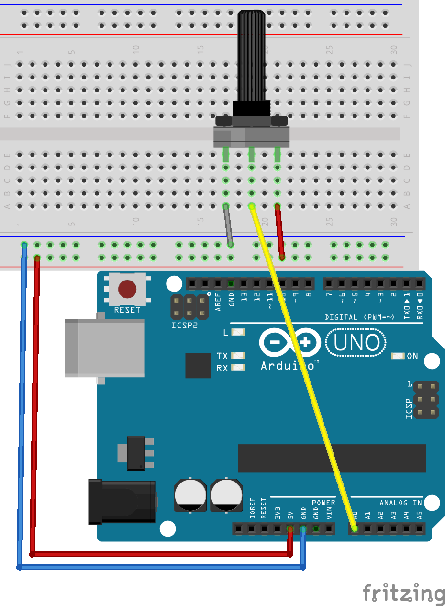

# Potenciometro

### Conexión:
Los pines del potenciometro es una resistencia que varia segun se rote su perilla, con esto podemos crear un divisor de voltaje que nos brinda una señal entre 0 y 5V.
Se requiere conectar pin exterior a GND y el otro a 5V, el pin del centro va al Arduino(entradas analógicas: A0 a A5).

<p align="center">

</p>

### Lectura simple
Nos permite leer el estdo de un pin analógico, retorna un valor entre 0 y 1023.
```c++
#define pinAnalogico = A0;  // Pin al que se conecta el potenciometro
int lectura = 0;
void setup() {
  //inicializa la comunicacion serial
  Serial.begin(9600); //9600 es la "velocidad", el mismo valor debe ser seleccionado en el monitor serial
}

void loop() {
  lectura = analogRead(pinAnalogico); //leer el valor en el pin
  Serial.print("sensor = ");
  Serial.println(lectura); // imprime el valor del sensor
  delay(10); //espera para la siguiente lectura
}
```
